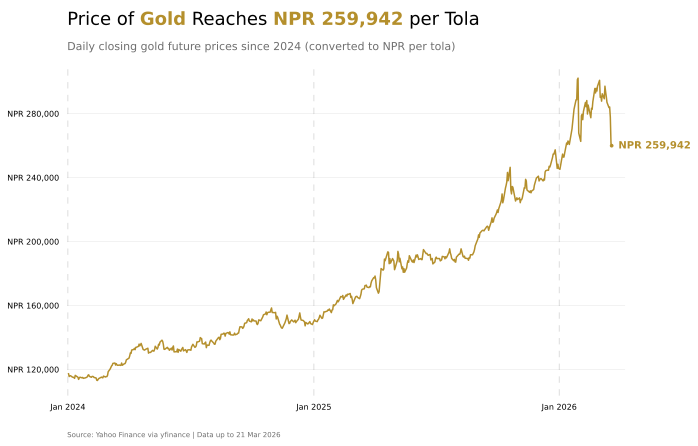

# Major Global Commodities

Data source: [Yahoo Finance](https://finance.yahoo.com/) (via [`yfinance`](https://ranaroussi.github.io/yfinance/))

## Gold Price per Tola 

## Commodity Price Performance in 2026 (YTD)

