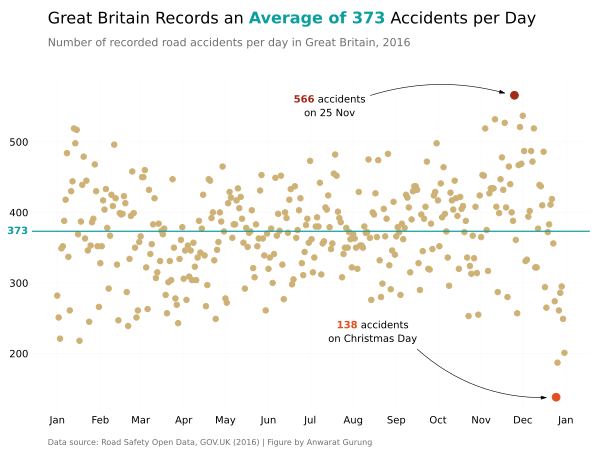
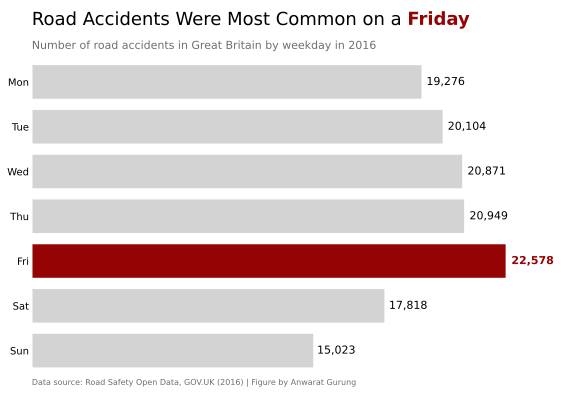
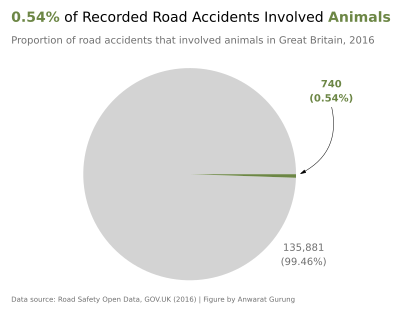
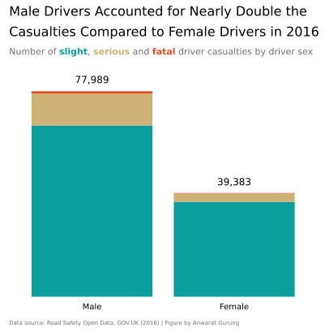

# Road Accidents in Great Britain (2016)

Data source : [Road Safety Open Data, GOV.UK](https://www.gov.uk/government/statistical-data-sets/road-safety-open-data)

## Scatter Plot: Daily Road Accidents

## Bar Chart: Accidents by Weekday

## Pie Chart: Proportion of Accidents Involving Animals

## Stacked Bar Chart: Casualty Severity by Sex

